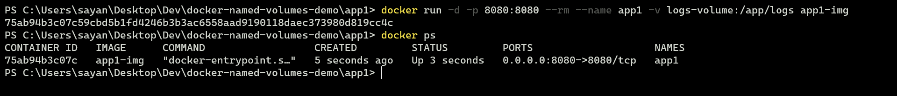

# Named Volumes in Docker


### What is Volume in Docker ?

In Docker, volumes are used to store data outside of the container. Volumes are folders created and managed by Docker that store data generated in your container.

### What are Named Volumes ?

Named volumes are used in Docker to persist data outside of a docker container because named volumes survive even after a container has been stopped and removed. Named Volumes are not attached to any particular container and hence can be used to share data across multiple containers

---

This example demonstrates how one can use named volumes to persist data and use it across multiple contianers. The idea of the project is to create two servers. One server generates a log file based on the requests received by it and the other server consumes that log file and processes it. 

## Setup

1. Clone the Project
```bash
git clone https://github.com/senshiii/docker-named-volumes-demo.git
```
```bash
cd docker-named-volumes-demo
```
2. Open a terminal

3. Navigate to app1

```bash
cd app1
```

4. Build the image of the first application

```bash
docker build -t app1-img .
```


In this step, we are building the image of the first app and tagging it with an identifier of `app1-img`

5. Run the container of the first application

```
docker run -d -p 8080:8080 --rm --name app1 -v logs-volume:/app/logs app1-img
```



In this step, we start the container of the first app using the image `app1-img`. 
- `-d` flag runs it in detached mode
- `-p 8080:8080` maps the port 8080 of our host machine to the port 8080 of thw container
- `--rm` flag will remove the container when stopped
- `--name` flag attaches a name ("app1")  as an identifier to the container
- `-v logs-volume:/app/logs` flag tells Docker to attach/mount the named volume "logs-volume" to the location `/app/logs` inside your container 

6. Navigate to app2

```bash
cd ../app2
```

7. Build image of second application

```bash
docker build -t app2-img .
```
~

This command builds the image of the second application

8. Run docker container of second application

```bash
docker run -d -p 9000:9000 --rm --name app2 -v logs-volume:/app/logs app2-img
```


In this step, we start the container of the second app using the image `app2-img`. 
- `-d` flag runs it in detached mode
- `-p 9000:9000` maps the port 9000 of our host machine to the port 9000 of the container
- `--rm` flag will remove the container when stopped
- `--name` flag attaches a name ("app2")  as an identifier to the container
- `-v logs-volume:/app/logs` flag tells Docker to attach/mount the named volume "logs-volume" to the location `/app/logs` inside your container 

9. Check running containers

```bash
docker ps
```


### Usage and Explanation
 
Make the following requests using either your browser or any HTTP Client

`http://localhost:8080/post`
`http://localhost:8080/post/1`
`http://localhost:8080/post/2`

The above requests return some JSON data created by the first application. Now, if you visit `http://localhost:8080/logs/log.txt`, you would see a file being returned which looks something like this


What's happening is the server in our first application is logging the requests received by it in a log.txt file in the `/app/logs` folder. This file is being mirrored in the `logs-volume` named volume. 

Now, hit the endpoint `http://localhost:9000/logs/log.txt`. You would see the exact same output as you saw before.

This is because both the containers mount the same named volume `logs-volume` into their internal folder `/app/logs`. The files in logs-volume is mirrored in the /apps/logs folder. The first app creates the files in the /app/logs, which is mirrored in the volume. The second app then consumes mirrors these files in its own /app/logs folder

Hopefully that was clear. 

Thanks and until next time <3
